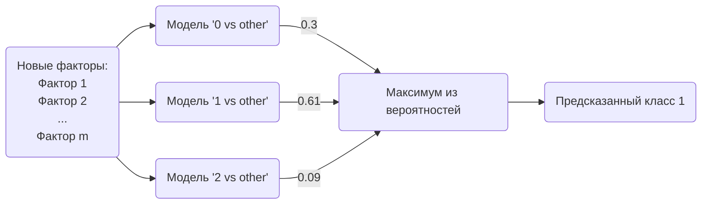

```mermaid
flowchart LR
    %% Блоки
    Factors("`Новые факторы:
    Фактор 1
    Фактор 2
    ...
    Фактор m
    `")

    Model0("Модель '0 vs other'")
    Model1("Модель '1 vs other'")
    Model2("Модель '2 vs other'")

    Maximum("Максимум из вероятностей")

    Result("Предсказанный класс 1")
    
    %% Связи
    Factors-->Model0
    Factors-->Model1
    Factors-->Model2

    Model0-->|0.3|Maximum
    Model1-->|0.61|Maximum
    Model2-->|0.09|Maximum

    Maximum-->Result
```