# Построение блок-схем с помощью mermaid.js

Библиотека [mermaid.js](https://mermaid.js.org/intro/) поддерживается github и позволяет рисовать блок-схемы в разметке `markdown`.

Для VS Code необходимо установить плагины
- Markdown All in One
- Mermaid Markdown Syntax Highlighting
- Markdown Preview Mermaid Support

## Задание направления диаграммы

[Документация Flowcharts](https://mermaid.js.org/syntax/flowchart.html)

### `flowchart TB` (top-bottom == сверху-вниз)

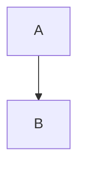

### `flowchart BT` (bottom-top == снизу вверх)

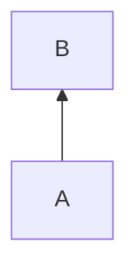

### `flowchart LR` (left-right == слева направо)

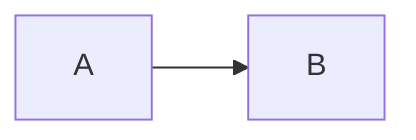

### `flowchart RL` (right-left == справа налево)

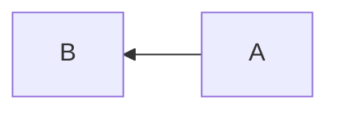

## Задание текста

Текст узла удобно задавать как переменную в квадратных скобках `A[node 1]`.

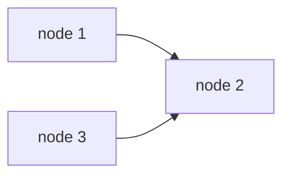

## Задание формы

Форма задается с помощью скобок разного вида.

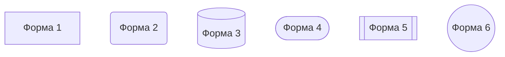

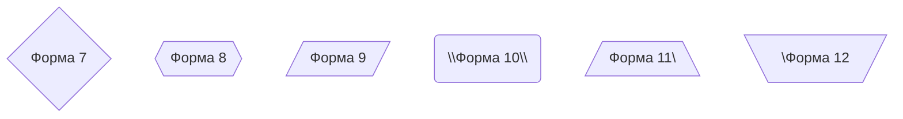

## Вид стрелок

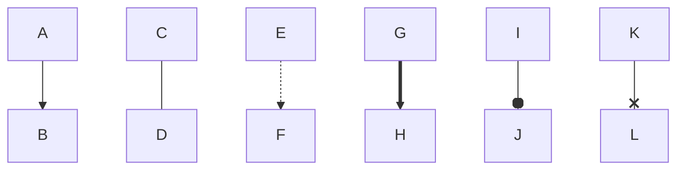

## Текст на стрелках

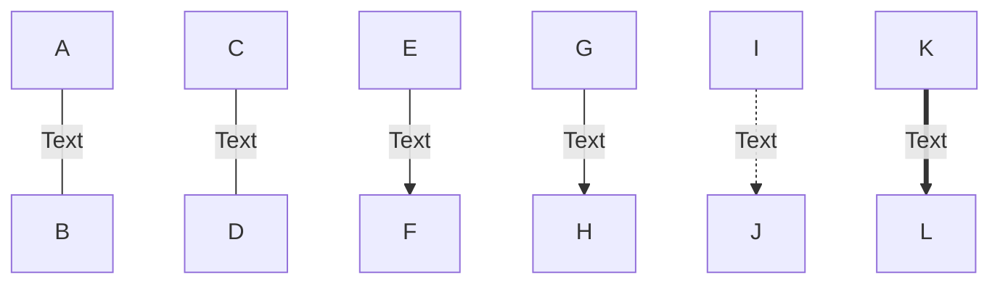

## Связи схем

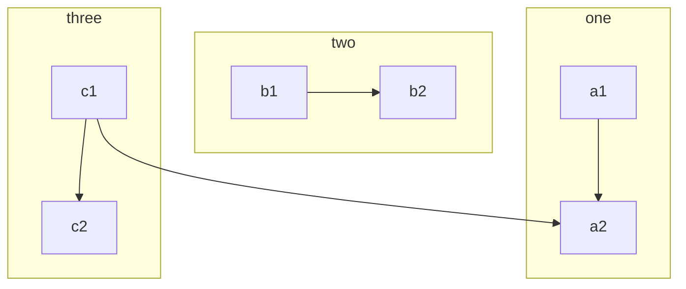

## Ссылки

## Стили

- `fill` - заливка
- `stroke` - цвет границы
- `stroke-width` - толщина границы
- `color` - цвет текста
- `stroke-dasharray` - пунктирная граница"
   

Стили также можно задавать в классах.

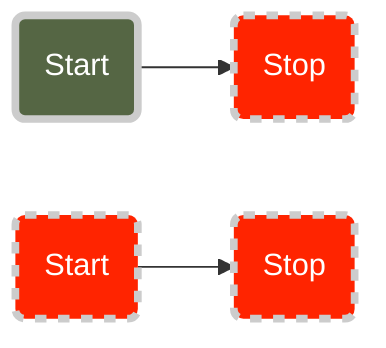

## Название
   
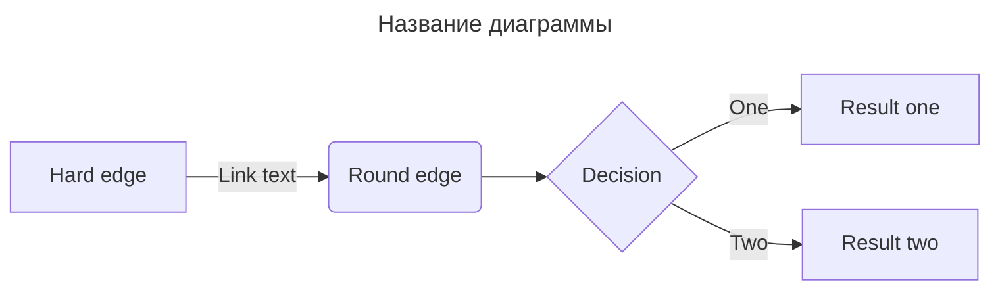

## Диаграммы состояний

[Документация State diagrams](https://mermaid.js.org/syntax/stateDiagram.html)
   
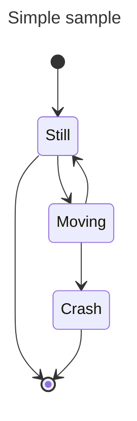

## Круговые диаграммы

[Документация Pie chart diagrams](https://mermaid.js.org/syntax/pie.html)
    
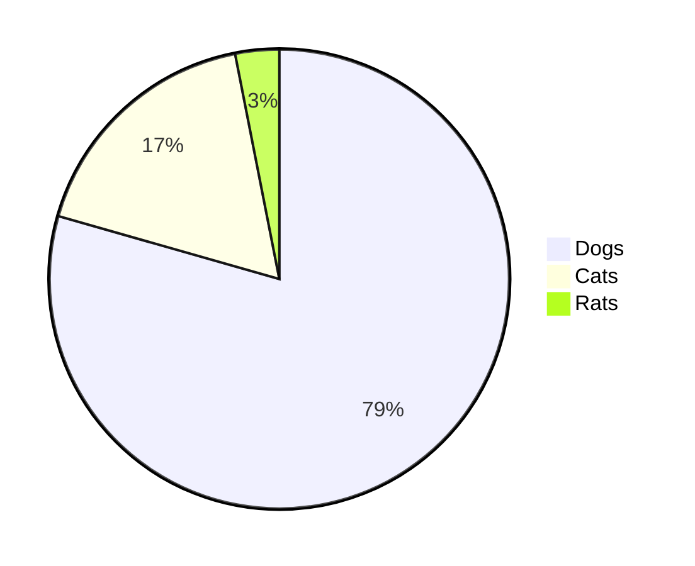

Возможные темы: forest, default, dark, neutral, base
   
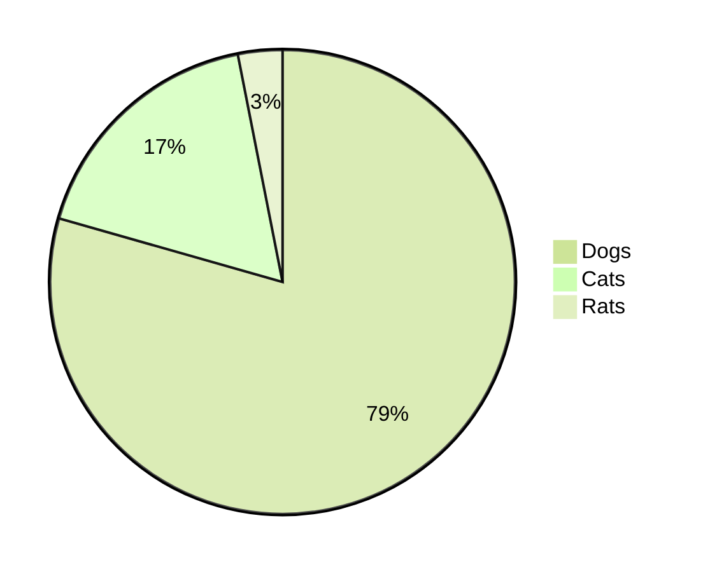

Диаграмма с названием

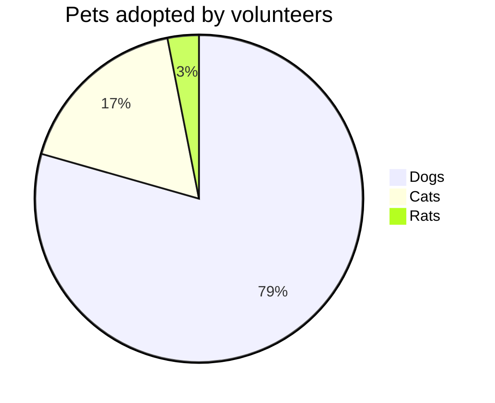

## Диаграммы Ганта

[Документация Gantt diagrams](https://mermaid.js.org/syntax/gantt.html)
   
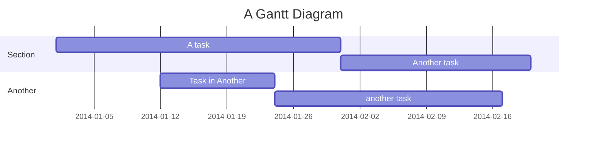

## Диаграммы классов

[Документация Class diagrams](https://mermaid.js.org/syntax/classDiagram.html)
   
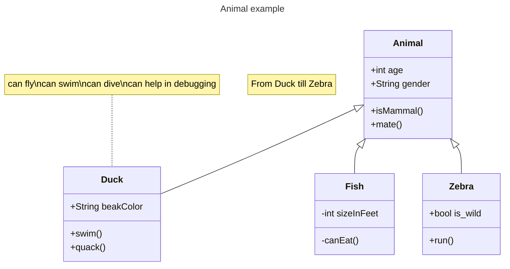

## Полезные ссылки

- [Рисуем диаграммы с помощью Mermaid.js и Markdown с Данилом Шатухиным](https://www.youtube.com/watch?v=uJuskThFWW8)